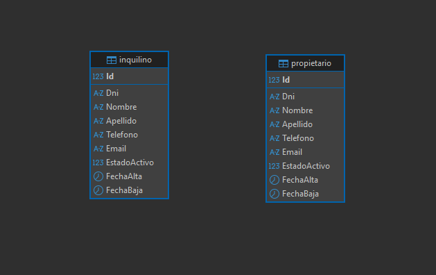

# InmobiliariaGrupoNN

Sistema web para la gestión de alquileres temporarios de propiedades de una inmobiliaria, desarrollado utilizando ASP.NET Core MVC.

## 👥 Integrantes del Grupo
* Tomas Abatedaga - abatedagatomas@gmail.com - @TomasAbatedaga - Discord: ztomy1
* Facundo Calderon - facu.eze.calderon@hotmail.com - @FacundoC2013 - Discord: facundoc2013

## 📐 Modelado de Datos

A continuación se presenta el esquema del modelo de datos correspondiente a la aplicación.

Diagrama Entidad-Relación (DER) / Diagrama de Clases

## 🗄️ Base de Datos

El proyecto utiliza MySQL como sistema de gestión de base de datos.

El repositorio incluirá un archivo .sql con las sentencias necesarias para crear e inicializar la base de datos del sistema.

## Instrucciones para levantar la base de datos

Para inicializar la base de datos localmente de forma manual, sigue estos pasos:

1. Abre tu gestor de base de datos (DBeaver o MySQL Workbench).
2. Asegúrate de tener una conexión activa a tu servidor local de MySQL.
3. Abre un nuevo editor de scripts SQL.
4. Abre el archivo `script.sql` (ubicado en la raíz de este repositorio).
5. Copia todo el código que contiene el archivo.
6. Pega ese código en la ventana en blanco del script SQL de tu gestor de base de datos.
7. Ejecuta el script completo .
8. Actualiza la vista de tus bases de datos (presionando `F5`). Verás creada la base de datos junto con las tablas correspondientes y los datos de prueba iniciales listos para usar.
9. Abre el archivo `appsettings.json` en el proyecto de Visual Studio / VS Code y actualiza la cadena de conexión (DefaultConnection) poniendo tu usuario, contraseña y puerto de MySQL.